# 🛒 HardwareTech — E-Commerce Catalog & Multi-Role Authentication System

> **Tugas Rutin 11 — Pemrograman Web**  
> Implementasi Database Relasional Kompleks, Eloquent ORM Eager Loading, Autentikasi Multi-Role (RBAC), dan Sistem Keamanan Otorisasi Berbasis Laravel 11.

---

## 🔗 Tautan Repositori

- **GitHub Repository:** [TugasWeb-P11-EcommerceAuth](https://github.com/tengkufahreza6-dev/TugasWeb-P11-EcommerceAuth.git)

---

## 👤 Informasi Mahasiswa

- **Nama Mahasiswa:** Tengku Fahreza
- **NIM:** 4252550005
- **Kelas:** PSIK 25B
- **Program Studi:** Ilmu Komputer
- **Mata Kuliah:** Pemrograman Web
- **Instansi:** Universitas Negeri Medan (UNIMED)
- **Repositori:** `TugasWeb-P11-EcommerceAuth`
- **Database Target:** `tugasweb_p11`

---

## 📌 Ringkasan Pemenuhan Persyaratan Tugas Rutin 11

Proyek ini telah mengimplementasikan seluruh kriteria **Bagian A (Database & Relasi)**, **Bagian B (Autentikasi & Otorisasi)**, serta **Fitur Bonus**:

| Kategori | Spesifikasi Tugas | Status Implementasi |
| :--- | :--- | :---: |
| **Database** | Minimal 5 tabel saling berelasi (`users`, `categories`, `products`, `orders`, `order_items`, `reviews`) | ✅ Terpenuhi |
| **Relasi Eloquent** | Relasi 1:1, 1:N (`hasMany`), dan N:M via Pivot (`belongsToMany` / `hasManyThrough`) | ✅ Terpenuhi |
| **Seeder & Factory** | Generasi 50+ data produk dengan nama hardware dan variasi gambar realistis | ✅ Terpenuhi (55 Produk) |
| **Query Eloquent** | 5 skenario query wajib (Eager Loading `with`, `withCount`, `whereHas`, relasi bertingkat) | ✅ Teruji 100% |
| **Autentikasi** | Sistem Login, Register, Logout, dan Manajemen Profil Akun (Laravel Breeze) | ✅ Terpenuhi |
| **Multi-Role (RBAC)** | Pembagian 3 Peran: `Admin`, `Editor`, dan `User` | ✅ Terpenuhi |
| **Middleware & Policy** | Proteksi Rute via `RoleMiddleware` & Otorisasi Granular berbasis `ProductPolicy` | ✅ Terpenuhi |
| **Desain UI/UX** | Dark-Mode Cyberpunk / Slate Modern yang konsisten di semua halaman & error page | 🌟 Fitur Bonus |
| **Custom Error Pages** | Halaman khusus penanganan error `403 Forbidden`, `404 Not Found`, `419`, & `500` | 🌟 Fitur Bonus |

---

## 🛡️ Matriks Hak Akses & Role-Based Access Control (RBAC)

Aplikasi menerapkan sistem pembatasan wewenang berjenjang menggunakan **RoleMiddleware** dan **ProductPolicy**:

| Aksi / Fitur | Tamu (Guest) | Pelanggan (`user`) | Editor Konten (`editor`) | Administrator (`admin`) |
| :--- | :---: | :---: | :---: | :---: |
| Jelajah Katalog Produk & Filter Kategori | ✅ | ✅ | ✅ | ✅ |
| Melihat Detail Spesifikasi Produk | ✅ | ✅ | ✅ | ✅ |
| Pengaturan Profil & Ganti Password | ❌ | ✅ | ✅ | ✅ |
| Menambah Produk Baru (`create`/`store`) | ❌ | ❌ | ✅ | ✅ |
| Mengubah Data Produk (`edit`/`update`) | ❌ | ❌ | ✅ | ✅ |
| Menghapus Produk Permanen (`destroy`) | ❌ | ❌ | ❌ (*403 Forbidden*) | ✅ (*Authorized*) |

---

## 🗄️ Entity Relationship Diagram (ERD)

Berikut adalah diagram relasi antar entitas database yang diimplementasikan dalam proyek ini:

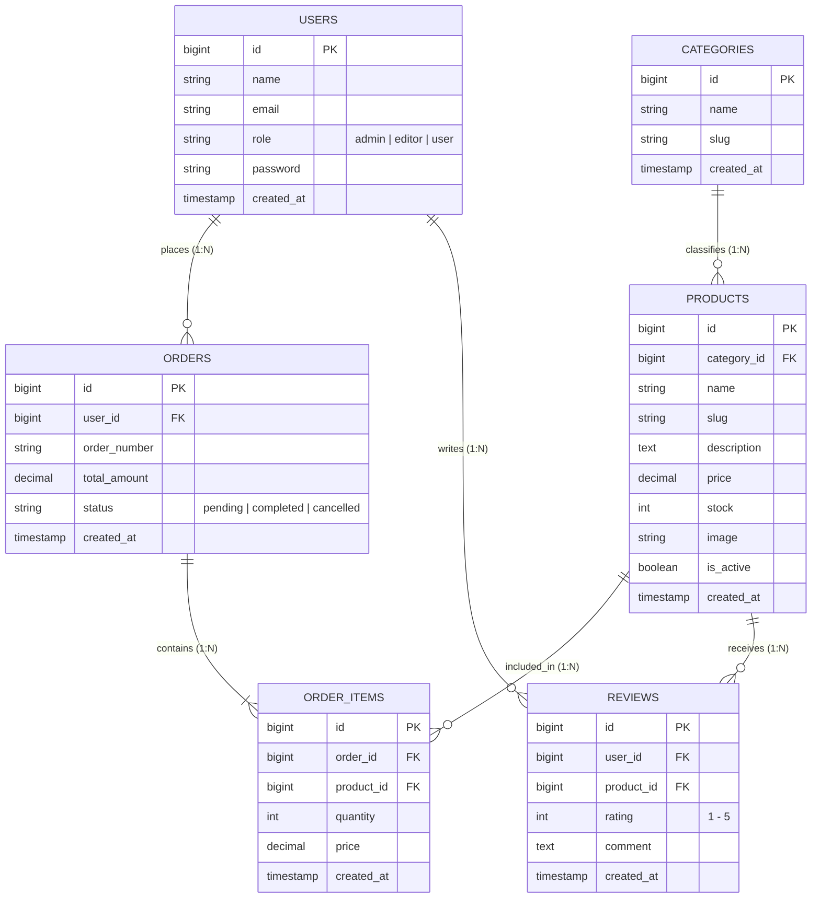

### 📋 Detail Relasi Antar Entitas (Eloquent ORM)

| Entitas Asal | Hubungan | Entitas Tujuan | Method Eloquent | Penjelasan Bisnis |
| :--- | :---: | :--- | :--- | :--- |
| `categories` | 1 : N | `products` | `Category::hasMany(Product::class)`<br>`Product::belongsTo(Category::class)` | Satu kategori memiliki banyak produk. Setiap produk wajib tergolong dalam 1 kategori. |
| `users` | 1 : N | `orders` | `User::hasMany(Order::class)`<br>`Order::belongsTo(User::class)` | Satu pengguna dapat memiliki banyak riwayat transaksi/pesanan. |
| `orders` | 1 : N | `order_items` | `Order::hasMany(OrderItem::class)`<br>`OrderItem::belongsTo(Order::class)` | Satu pesanan terdiri dari satu atau beberapa item produk yang dibeli. |
| `products` | 1 : N | `order_items` | `Product::hasMany(OrderItem::class)`<br>`OrderItem::belongsTo(Product::class)` | Satu produk dapat tercatat di banyak item pesanan pelanggan. |
| `orders` | N : M | `products` | Via Pivot Table `order_items` | Hubungan Many-to-Many antara pesanan dan produk yang dipesan. |
| `users` | 1 : N | `reviews` | `User::hasMany(Review::class)`<br>`Review::belongsTo(User::class)` | Satu pengguna dapat memberikan banyak ulasan produk. |
| `products` | 1 : N | `reviews` | `Product::hasMany(Review::class)`<br>`Review::belongsTo(Product::class)` | Satu produk dapat menerima banyak ulasan dan rating dari pembeli. |

---

## 📸 Dokumentasi & Hasil Pengujian 5 Query Eloquent ORM

Pengujian dilakukan secara interaktif menggunakan shell `php artisan tinker` untuk membuktikan integritas relasi antar model.

### 1. Query 1: Eager Loading Produk Aktif Beserta Kategorinya (`with`)

Mencegah masalah N+1 Query Problem dengan memuat data produk aktif sekaligus kategori induknya secara efisien.

```php
App\Models\Product::with('category')->where('is_active', true)->take(3)->get();
```

**Screenshot Hasil Eksekusi Query 1:**

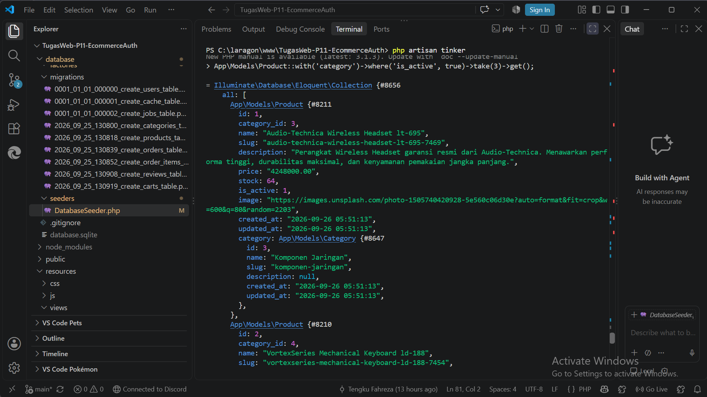

### 2. Query 2: Menghitung Agregasi Relasi Produk per Kategori (`withCount`)

Mengambil seluruh kategori dan menghitung akumulasi total produk di dalamnya tanpa me-load relasi ke memori.

```php
App\Models\Category::withCount('products')->get();
```

**Screenshot Hasil Eksekusi Query 2:**

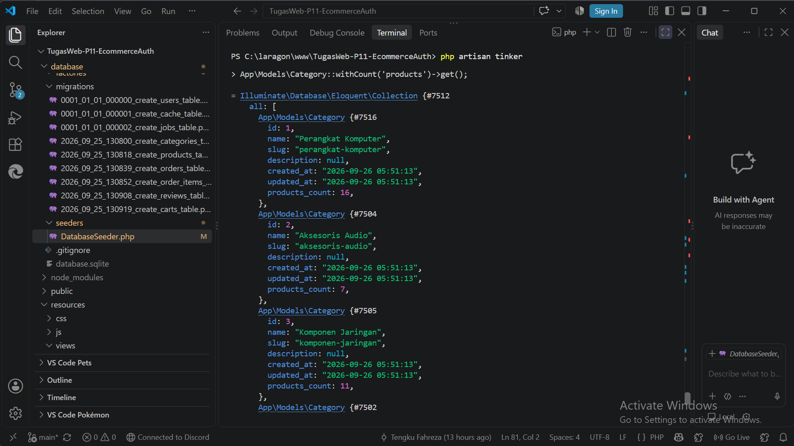

### 3. Query 3: Filter Produk Berdasarkan Relasi Kategori Tertentu (`whereHas`)

Menyaring dan menampilkan data produk yang hanya berelasi dengan kategori spesifik (contoh: Kategori ID 1).

```php
App\Models\Product::whereHas('category', function ($query) {
    $query->where('id', 1);
})->take(3)->get();
```

**Screenshot Hasil Eksekusi Query 3:**

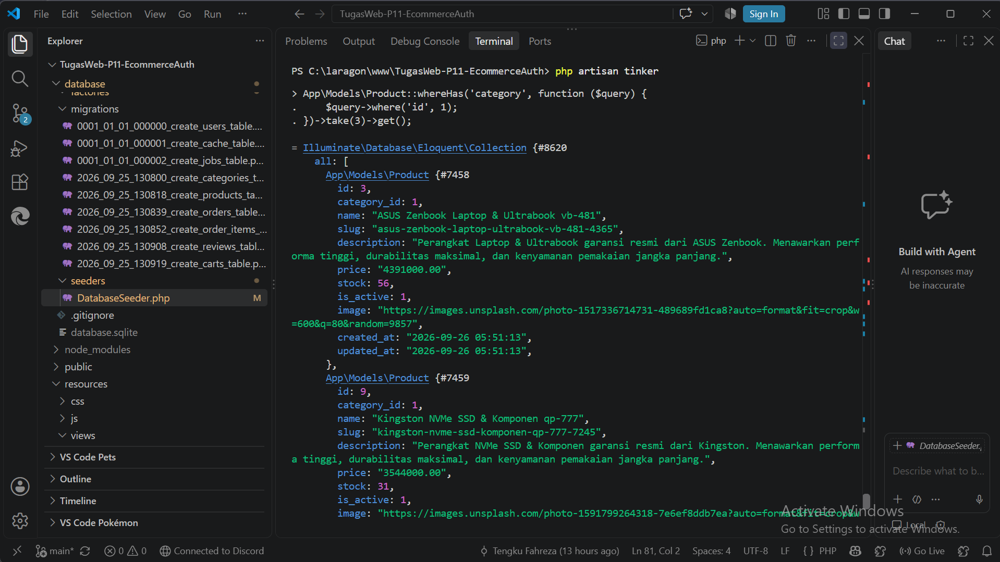

### 4. Query 4: Mengambil Data Pengguna Beserta Riwayat Order (`hasMany`)

Membuktikan keterhubungan relasi One-to-Many antara entitas pengguna (`users`) dan pesanan (`orders`).

```php
App\Models\User::with('orders')->has('orders')->first();
```

**Screenshot Hasil Eksekusi Query 4:**

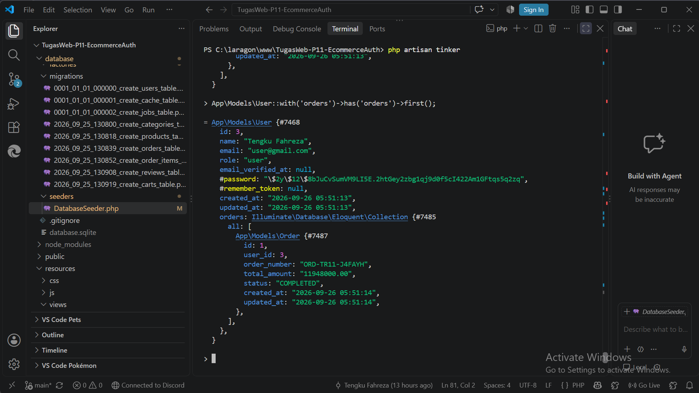

### 5. Query 5: Detail Transaksi Bertingkat (Nested Eager Loading)

Mengambil rincian pesanan, informasi akun pemesan, serta daftar produk yang dibeli melalui relasi berlapis `orderItems.product`.

```php
App\Models\Order::with(['user', 'orderItems.product'])->first();
```

**Screenshot Hasil Eksekusi Query 5:**

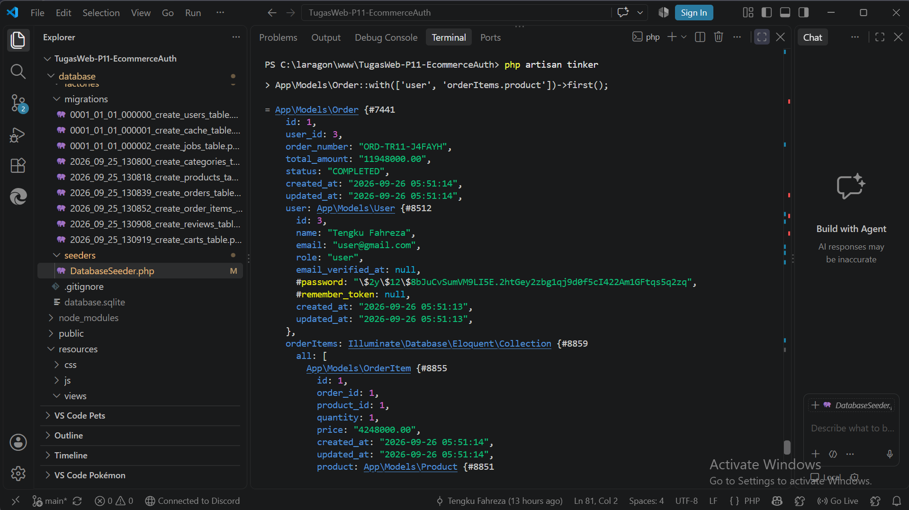

---

## 🖥️ Dokumentasi Antarmuka Aplikasi (User Interface)

### 1. Halaman Autentikasi (Laravel Breeze)

| Halaman Login | Halaman Register |
| :---: | :---: |
| 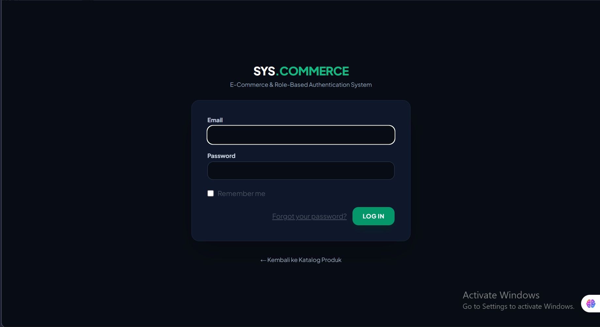 | 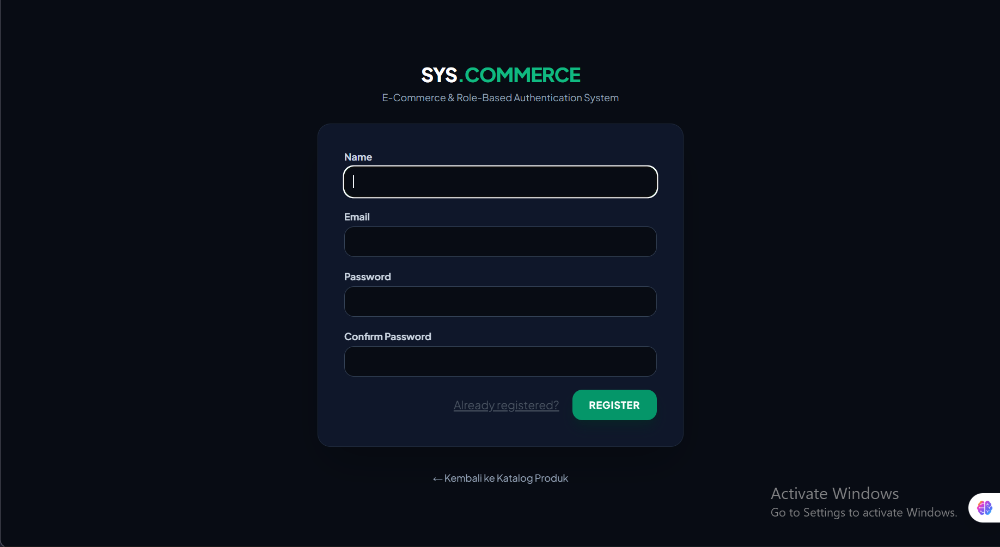 |
| Form login dengan validasi & proteksi CSRF | Form registrasi akun baru pengguna |

| Halaman Edit Profile |
| :---: |
| 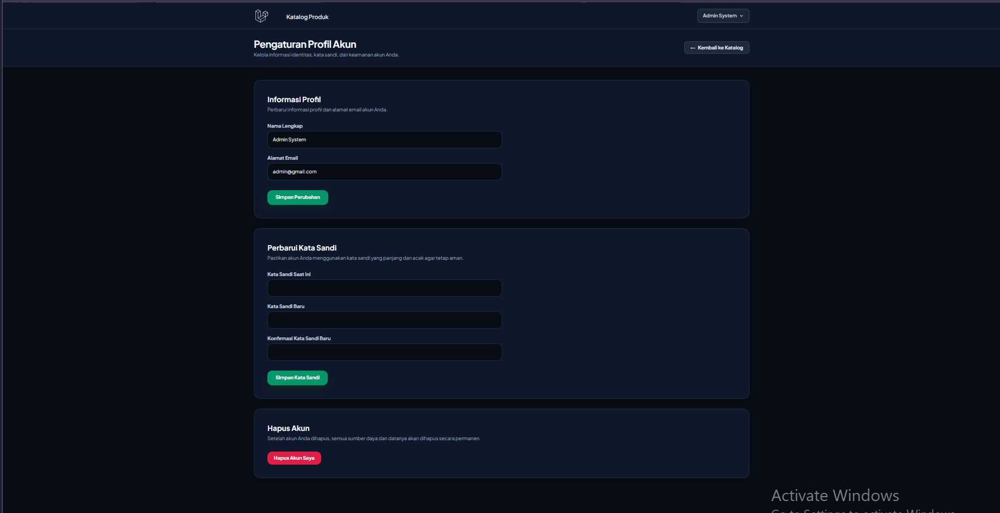 |
| Manajemen akun & ganti password pengguna terautentikasi |

### 2. Halaman Katalog & Manajemen Produk

| Tampilan Katalog Publik | Manajemen Produk (Admin/Editor Action) |
| :---: | :---: |
| 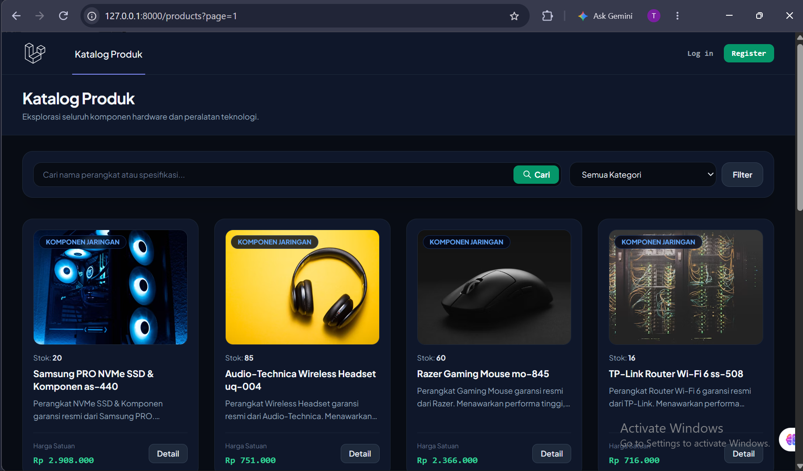 | 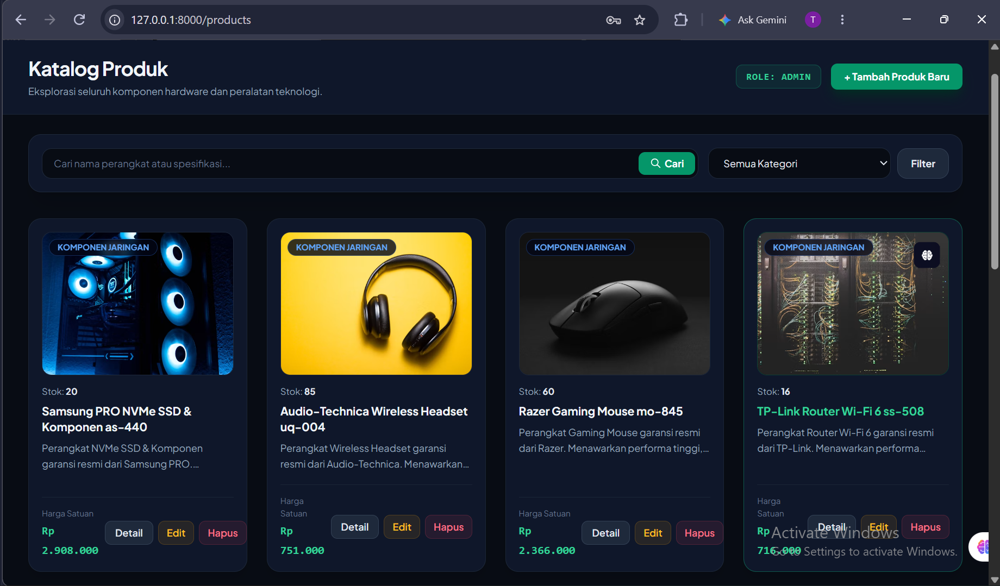 |
| Katalog responsif lengkap dengan filter kategori & pencarian | Tombol Create, Edit, dan Delete khusus pengguna berotoritas |

### 3. Otorisasi & Keamanan Role-Based Access Control

| Otorisasi Diterima (Admin 200 OK) | Keamanan Intersepsi (403 Forbidden) |
| :---: | :---: |
| 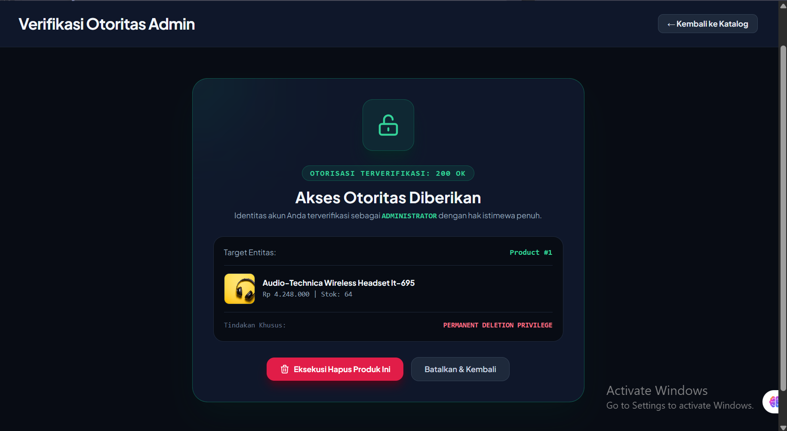 | 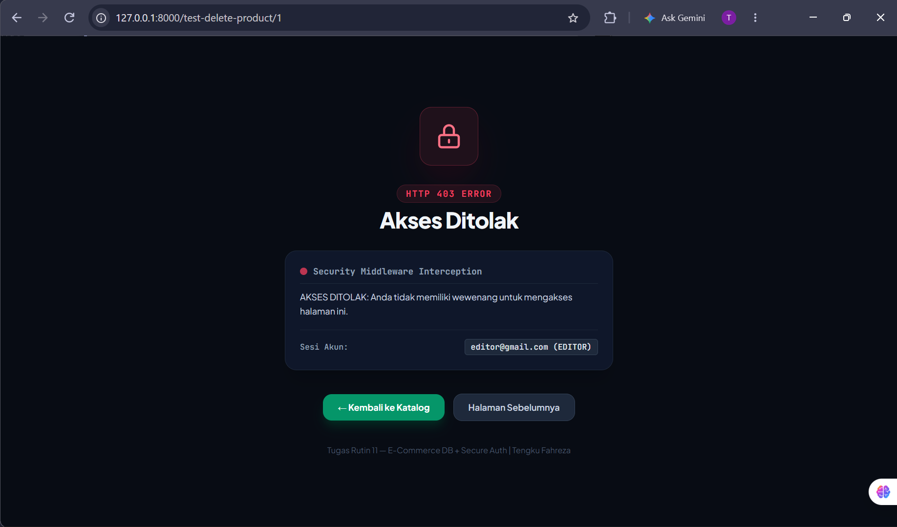 |
| Verifikasi wewenang hak istimewa role Admin untuk hapus produk | Tampilan proteksi terpadu saat hak akses tidak mencukupi |

### 4. Database & Verifikasi Seeder (HeidiSQL)

| Struktur 6 Tabel Database | Data Users (3 Role Hasil Seeder) |
| :---: | :---: |
| 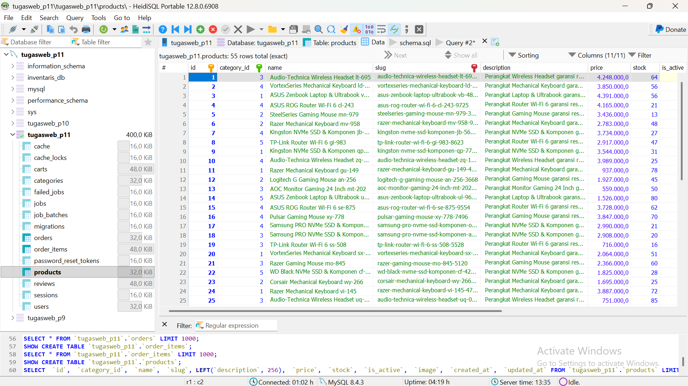 | 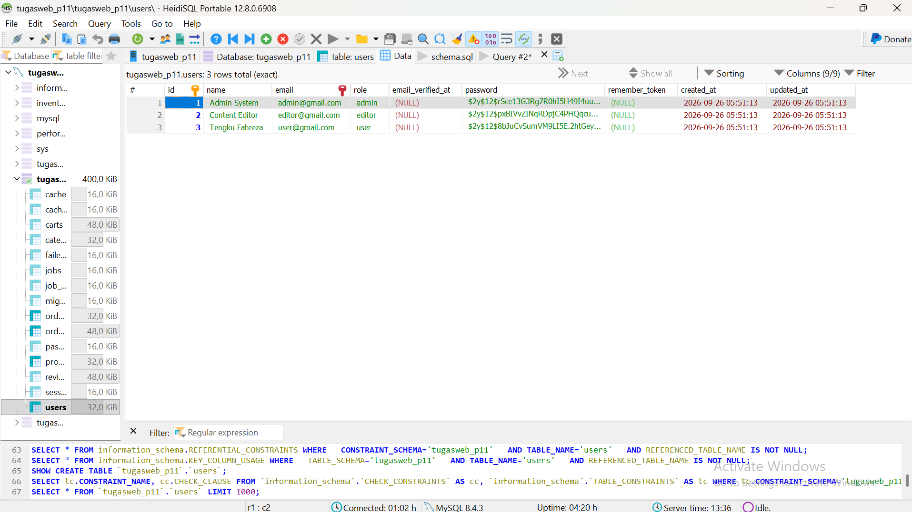 |
| Bukti migrasi berhasil membuat 6 tabel relasional | Bukti seeder membuat 3 akun: admin, editor, user |

### 5. Custom Error Page

| Halaman Error 404 Not Found |
| :---: |
| 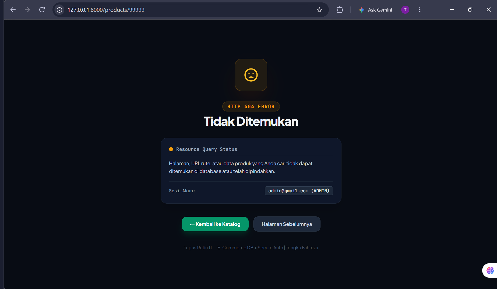 |
| Custom error page dengan tema Dark-Mode Cyberpunk |

---

## 📁 Struktur Direktori Penting Proyek

```text
TugasWeb-P11-EcommerceAuth/
├── app/
│   ├── Http/
│   │   ├── Controllers/
│   │   │   ├── ProductController.php       # Controller katalog & CRUD produk berotorisasi
│   │   │   └── ProfileController.php       # Pengelolaan data profil pengguna
│   │   └── Middleware/
│   │       └── RoleMiddleware.php          # Intersepsi request berbasis role (admin/editor/user)
│   ├── Models/
│   │   ├── Category.php                    # Model kategori (hasMany Product)
│   │   ├── Order.php                       # Model pesanan (belongsTo User, hasMany OrderItem)
│   │   ├── OrderItem.php                   # Model detail pesanan (belongsTo Product)
│   │   ├── Product.php                     # Model produk (belongsTo Category, hasMany Reviews)
│   │   ├── Review.php                      # Model ulasan produk
│   │   └── User.php                        # Model akun & atribut role pengguna
│   └── Policies/
│       └── ProductPolicy.php               # Kebijakan izin Create/Update/Delete produk
├── database/
│   ├── factories/
│   │   └── ProductFactory.php              # Generator 55 produk unik dengan gambar hardware bervariasi
│   ├── migrations/                         # Skema database relasional lengkap
│   └── seeders/
│       └── DatabaseSeeder.php              # Seeder otomatis akun, kategori, produk, dan order
├── resources/
│   └── views/
│       ├── admin/
│       │   └── authorized-delete.blade.php # Halaman verifikasi wewenang eksekusi hapus admin
│       ├── errors/                         # Custom error pages terpadu (403, 404, 419, 500)
│       ├── products/                       # Tampilan antarmuka katalog, create, edit, show
│       └── profile/                        # Halaman konfigurasi akun & kata sandi
└── routes/
    ├── web.php                             # Konfigurasi rute dan proteksi middleware role
    └── auth.php                            # Rute otentikasi bawaan Breeze
```

---

## 🚀 Panduan Instalasi & Menjalankan Proyek

Ikuti langkah-langkah berikut untuk menjalankan repositori ini di lingkungan lokal Anda:

### 1. Kloning Repositori

```bash
git clone https://github.com/tengkufahreza6-dev/TugasWeb-P11-EcommerceAuth.git
cd TugasWeb-P11-EcommerceAuth
```

### 2. Instal Dependensi PHP & Node.js

```bash
composer install
npm install
```

### 3. Konfigurasi Lingkungan (`.env`)

Salin file `.env.example` menjadi `.env`:

```bash
cp .env.example .env
```

Sesuaikan konfigurasi database target di file `.env`:

```env
DB_CONNECTION=mysql
DB_HOST=127.0.0.1
DB_PORT=3306
DB_DATABASE=tugasweb_p11
DB_USERNAME=root
DB_PASSWORD=
```

### 4. Generate Kunci Aplikasi

```bash
php artisan key:generate
```

### 5. Jalankan Migrasi & Seeding Data Otomatis

Perintah ini akan membuat seluruh tabel relasional, 3 akun pengguna, kategori, 55 data produk unik, dan data riwayat transaksi awal:

```bash
php artisan migrate:fresh --seed
```

### 6. Kompilasi Asset & Jalankan Server Lokal

Buka **dua terminal terpisah**:

```bash
# Terminal 1: Asset Bundler
npm run dev

# Terminal 2: Server Laravel
php artisan serve
```

Aplikasi sekarang dapat diakses melalui browser di: **`http://127.0.0.1:8000`**

---

## 🔑 Kredensial Akun Pengujian Default

> Seluruh akun default menggunakan kata sandi: **`password`**

| Akun Role | Alamat Email | Kata Sandi | Hak Istimewa |
| :--- | :--- | :--- | :--- |
| **Administrator** | `admin@gmail.com` | `password` | Akses penuh (Katalog, Tambah, Edit, Hapus Produk) |
| **Content Editor** | `editor@gmail.com` | `password` | Pengelolaan data (Katalog, Tambah, Edit Produk) |
| **Regular User** | `user@gmail.com` | `password` | Hak pelanggan (Lihat katalog, detail produk, edit profil) |

---

<p align="center">
  <strong>© 2026 Tengku Fahreza — PSIK 25B — UNIMED</strong><br>
  Dibuat untuk pemenuhan tugas akademik <strong>Tugas Rutin 11</strong> mata kuliah Pemrograman Web.
</p>